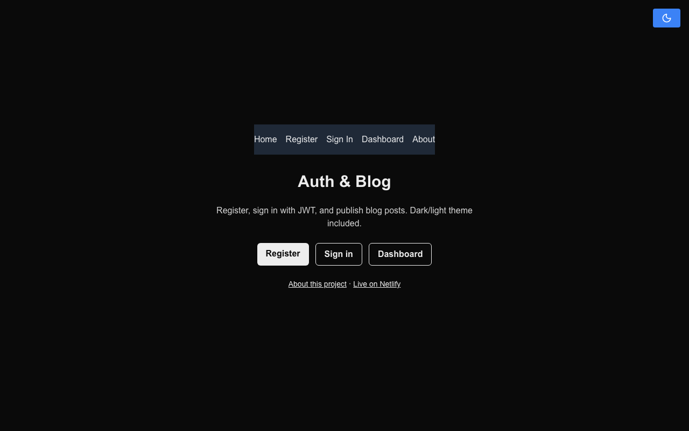
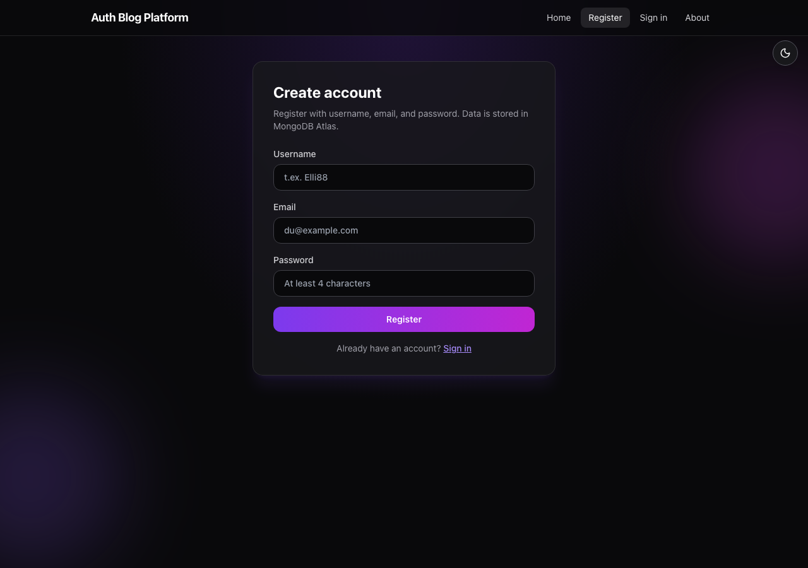
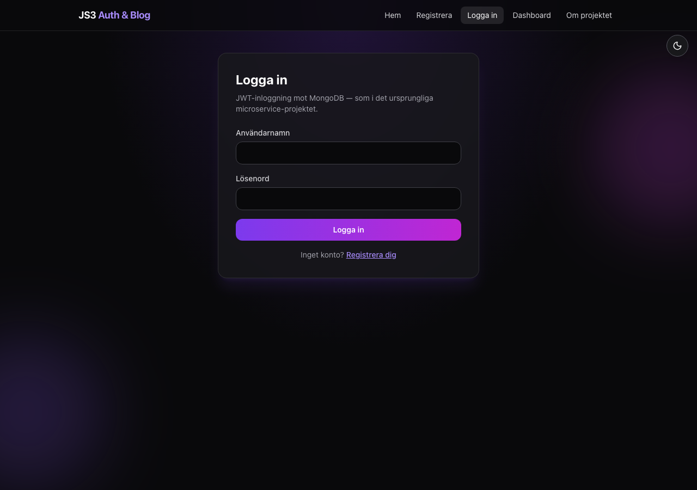

# js3-auth-blog-platform

[](https://javascript-course-3-auth-blog.netlify.app)

**JavaScript 3 major assignment (FE22, autumn 2023)** — full-stack auth & blog app.  
Originally built as many small repos (`users-ms-*`, `My-Next.js-Project`); consolidated here.

This was my **first larger project** where I learned to set up the whole system myself: Next.js UI, API, **MongoDB Atlas**, **Redis** caching, and JWT. Only a few classmates finished a complete version without constant teacher help (~3, including me).

## Live demo

**https://javascript-course-3-auth-blog.netlify.app**

| Page | URL |
|------|-----|
| About (course background + live link) | [/about](https://javascript-course-3-auth-blog.netlify.app/about) |
| Health check | [/api/health](https://javascript-course-3-auth-blog.netlify.app/api/health) |

## Screenshots

| Home | Register | Sign in |
|------|----------|---------|
|  |  |  |

## Course context

| | |
|--|--|
| **Course** | JavaScript 3 (FE22) |
| **Type** | **Major assignment** (not `slutprojekt`, not JS1/JS2 mini project) |
| **Period** | Oct–Nov 2023 |
| **Original DB** | MongoDB Atlas `JS3-app` / `Users` |
| **Also used** | Redis (user + JWT cache in original Express version) |

## Features

- Dark / light theme
- Registration, JWT sign-in, protected blog posts
- bcrypt passwords (legacy MD5 still accepted)
- Netlify deployment with Next.js runtime

## Local setup

```bash
cp .env.example .env.local
# MONGODB_URI, JWT_SECRET, MONGODB_DB_NAME=JS3-app, MONGODB_COLLECTION=Users
npm install
npm run dev
```

## Netlify environment variables

| Variable | Required |
|----------|----------|
| `MONGODB_URI` | Yes (Atlas connection string) |
| `JWT_SECRET` | Yes |
| `MONGODB_DB_NAME` | `JS3-app` |
| `MONGODB_COLLECTION` | `Users` |
| `NEXT_PUBLIC_SITE_URL` | `https://javascript-course-3-auth-blog.netlify.app` |

If registration fails, open `/api/health` — it reports whether MongoDB is reachable.

## API

| Method | Path | Description |
|--------|------|-------------|
| `GET` | `/api/health` | DB / config status |
| `POST` | `/api/v1/user` | Register |
| `POST` | `/api/login` | Sign in |
| `POST` | `/api/v1/user/blog` | Blog post (Bearer JWT) |

## Legacy branches

Version snapshots from 2023 coursework: `version/main` … `version/redis-cache` on `master` history.
