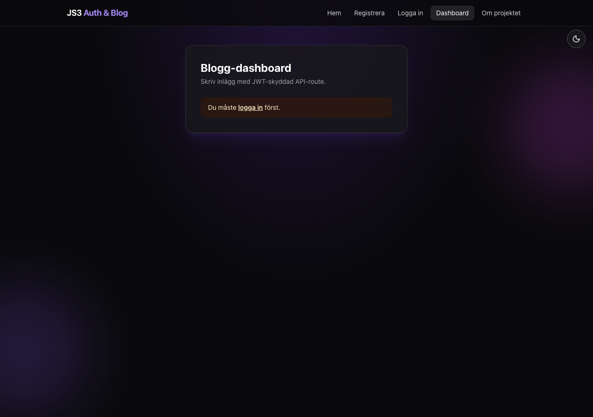
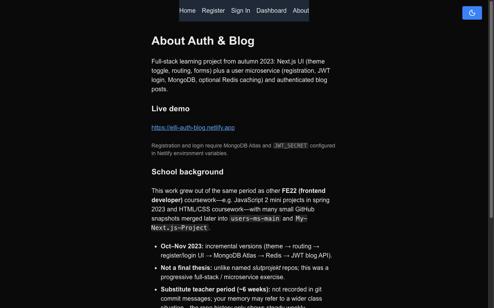

# Auth Blog Platform

[](https://github.com/Elli2022/auth-blog-platform/actions/workflows/netlify-deploy.yml)
[](https://auth-blog-platform.netlify.app)

[](https://nextjs.org/)
[](https://www.typescriptlang.org/)
[](https://www.mongodb.com/atlas)
[](https://jwt.io/)
[](https://tailwindcss.com/)
[](https://github.com/Elli2022/auth-blog-platform/actions)

<p align="center">
  <strong>Full-stack authentication and blog platform</strong><br>
  Register, sign in with JWT, and manage personal blog posts from a protected dashboard.
</p>

<p align="center">
  <strong><a href="https://auth-blog-platform.netlify.app">https://auth-blog-platform.netlify.app</a></strong>
</p>

## Overview

A production-style portfolio project built with **Next.js 14**, **MongoDB Atlas**, and **JWT authentication**. Users can create an account, sign in, and publish blog posts stored in the cloud. API routes run as Netlify serverless functions; the frontend uses TypeScript and Tailwind CSS with a dark/light theme.

This repo consolidates earlier microservice experiments into a single maintainable codebase.

## Features

| Feature | Description |
|---------|-------------|
| User registration | Username, email, and bcrypt-hashed password stored in MongoDB |
| JWT sign-in | Bearer tokens for authenticated API access |
| Blog dashboard | Create and list posts scoped to the signed-in user |
| Health check | `/api/health` reports database connectivity |
| CI/CD | GitHub Actions deploys to Netlify on push to `master` |

## Live demo

| Page | URL |
|------|-----|
| Home | [/](https://auth-blog-platform.netlify.app/) |
| Register | [/register](https://auth-blog-platform.netlify.app/register) |
| Sign in | [/signin](https://auth-blog-platform.netlify.app/signin) |
| Dashboard | [/dashboard](https://auth-blog-platform.netlify.app/dashboard) |
| About | [/about](https://auth-blog-platform.netlify.app/about) |
| Health | [/api/health](https://auth-blog-platform.netlify.app/api/health) |

## Screenshots

| Home | Register | Sign in |
|------|----------|---------|
|  |  |  |

| Dashboard | About |
|-----------|-------|
|  |  |

## Tech stack

- **Frontend:** Next.js 14 (Pages Router), React, TypeScript, Tailwind CSS
- **Backend:** Next.js API routes (`/api/login`, `/api/v1/user`, `/api/v1/user/blog`)
- **Database:** MongoDB Atlas
- **Auth:** JWT + bcrypt (legacy MD5 passwords still accepted for older accounts)
- **Hosting:** Netlify with `@netlify/plugin-nextjs`

## Local development

```bash
git clone https://github.com/Elli2022/auth-blog-platform.git
cd auth-blog-platform
npm ci
cp .env.example .env.local
# Fill in MONGODB_URI, JWT_SECRET, and optional NEXT_PUBLIC_SITE_URL
npm run dev
```

Open [http://localhost:3000](http://localhost:3000).

### Environment variables

| Variable | Required | Description |
|----------|----------|-------------|
| `MONGODB_URI` | Yes | MongoDB Atlas connection string |
| `JWT_SECRET` | Yes | Secret for signing JWTs |
| `MONGODB_DB_NAME` | No | Database name (default: `JS3-app`) |
| `MONGODB_COLLECTION` | No | Users collection (default: `Users`) |
| `NEXT_PUBLIC_SITE_URL` | No | Public site URL for metadata and API client |

## Project structure

```
src/
├── components/     # Layout, navbar, UI primitives, status pills
├── lib/            # MongoDB client, JWT helpers, site config
└── pages/
    ├── api/        # Auth, user registration, blog CRUD, health
    ├── dashboard.tsx
    ├── register.tsx
    ├── signin.tsx
    └── about.tsx
```

## Project lineage

This repo replaces three archived experiments from 2023–2024:

| Archived repo | Why archived |
|---------------|--------------|
| [fullstack-application](https://github.com/Elli2022/fullstack-application) | Early MERN prototype — MD5 passwords, hardcoded secrets |
| [fullstack-application-legacy](https://github.com/Elli2022/fullstack-application-legacy) | Duplicate legacy snapshot |
| [fullstack-app-backend-service](https://github.com/Elli2022/fullstack-app-backend-service) | Split backend fragment of the same experiment |

For a larger full-stack showcase, see **[community-hub](https://github.com/Elli2022/community-hub)** (PostgreSQL, social feed, DMs, OpenAPI).

## Related project

[authentication-service](https://github.com/Elli2022/authentication-service) — an earlier Express-based authentication exercise kept as a separate archive.

## License

MIT — see repository for details.
